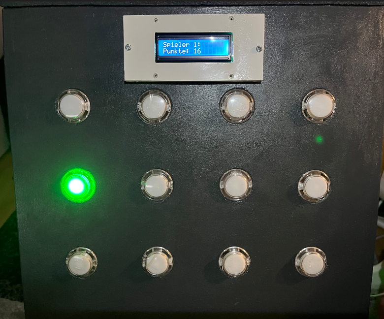

# Button-Multispiel

Ein 2-Spieler-Multispiel auf Basis eines Raspberry Pi Pico 2 und MicroPython.

Das System besteht aus mehreren Buttons, 25 NeoPixel-Leuchtdioden (LED) und zwei 16x2 Liquid-Crystal-Display-Modulen (LCD). Über ein kleines Menü können drei verschiedene Spiele ausgewählt werden:

* Battleship
* Simon Says
* Reaction Game

Die Buttons werden über zwei MCP23017 I/O-Expander eingelesen. Die LEDs dienen als visuelles Feedback und bilden je nach Spiel teilweise das Spielfeld ab. Die beiden LCDs zeigen Informationen für die jeweiligen Spieler an.

## Hardware

* Raspberry Pi Pico 2
* 2x MCP23017 I/O-Expander
* 25x NeoPixel-LEDs
* 2x 16x2 LCD mit Inter-Integrated Circuit (I²C)
* mehrere Buttons

### Pinbelegung

| Komponente      | Pico Pin          | I²C-Adresse   |
| --------------- | ------------------ | ------------- |
| MCP23017 (2x)   | SDA GP0 / SCL GP1  | 0x20 / 0x21   |
| LCD (2x)        | SDA GP6 / SCL GP7  | 0x26 / 0x27   |
| NeoPixel        | GP2                | -             |
| Menü-Button     | GP14               | -             |

Die beiden MCP23017 hängen am ersten I²C-Bus, die beiden LCDs am zweiten. Jedes Gerät wird über seine eigene I²C-Adresse angesprochen.

## Spiele

### Battleship

Battleship ist für zwei Spieler ausgelegt. Zu Beginn platziert jeder Spieler drei Schiffe, indem er entsprechende Buttons auswählt. Die Positionen werden über die LEDs angezeigt.

Danach greifen die Spieler abwechselnd an. Ein Treffer wird über die LEDs und die LCDs angezeigt. Bei einem Treffer darf der Spieler erneut schießen, bei einem Fehlschuss ist der andere Spieler an der Reihe.

Zusätzlich werden die Anzahl der Schüsse und die Trefferquote erfasst und am Ende angezeigt.

### Simon Says

Bei Simon Says erstellt ein Spieler eine Sequenz aus Button-Eingaben. Jeder Button bekommt dabei eine zufällige Farbe, die über die LEDs angezeigt wird. Der zweite Spieler wiederholt anschließend die gleiche Sequenz.

Wird die Sequenz korrekt wiederholt, gibt es einen Punkt und die Sequenz wird in der nächsten Runde länger. Das Spiel ist auf fünf Runden ausgelegt.

Bei einer falschen Eingabe endet die Runde und die Spieler wechseln.

### Reaction Game

Beim Reaction Game treten die beiden Spieler direkt gegeneinander an.

Für jeden Spieler wird pro Runde zufällig ein Button ausgewählt. Die entsprechenden LEDs zeigen an, welcher Button gedrückt werden muss. Wer zuerst den richtigen Button drückt, gewinnt die Runde.

Ein falscher Button führt ebenfalls zu einer Reaktion: Der Gegner bekommt den Punkt, und die LEDs des Spielers blinken als Fehleranzeige.

Das Spiel besteht aus zehn Runden. Nach jeder Runde wird der aktuelle Punktestand auf beiden LCDs angezeigt.

## Menü

Das Hauptprogramm startet mit einem Menü, über das die drei Spiele ausgewählt werden können.

Der Menü-Button unterscheidet zwischen kurzem und langem Drücken:

| Eingabe                    | Funktion                   |
| -------------------------- | -------------------------- |
| kurzer Druck               | nächstes Spiel             |
| langer Druck               | ausgewähltes Spiel starten |
| abgebrochener langer Druck | zurück zum Menü            |

Beim langen Drücken wird der Fortschritt zusätzlich auf den LCDs und über die LEDs angezeigt.

Nach dem Ende eines Spiels kehrt das Programm wieder zum Hauptmenü zurück.

## LEDs

Die 25 NeoPixel werden für die verschiedenen Spiele unterschiedlich genutzt.

Bei Battleship zeigen sie unter anderem die Positionen der Schiffe sowie Treffer und Fehlschüsse an. Die Zuordnung zwischen Buttons und LEDs ist für Spieler 1 und Spieler 2 getrennt definiert.

Bei Simon Says stellen die LEDs die aktuelle Sequenz dar. Die Farben werden zufällig ausgewählt und während der Eingabe gespeichert.

Beim Reaction Game zeigen die LEDs die zufällig ausgewählten Ziel-Buttons der beiden Spieler an.

## LCDs

Beide Spieler haben ein eigenes 16x2 LCD.

Die Displays werden unter anderem für folgende Informationen verwendet:

* Spielauswahl
* Spielstart
* aktueller Spieler
* Runden
* Punktestand
* Countdown
* Treffer und Fehlschüsse
* Spielende

Bei bestimmten Aktionen werden beide Displays gleichzeitig aktualisiert. Während eines Zugs kann dagegen gezielt nur das Display des aktiven Spielers eine Meldung anzeigen.

## Software

Das Projekt wurde mit MicroPython umgesetzt.

Verwendete Standardbibliotheken:

```text
machine
time
random
neopixel
```

Zusätzlich werden folgende externe Bibliotheken für die Hardware-Anbindung benötigt. Sie sind nicht Teil dieses Repositories und müssen separat auf den Pico übertragen werden:

```text
mcp23017
machine_i2c_lcd
```

Die einzelnen Spiele sind als eigene Python-Dateien aufgebaut:

```text
menu.py
battleship.py
simon_says.py
reaction_game.py
```

Die Hardware wird im Hauptprogramm initialisiert. Anschließend übernimmt das Menü die Auswahl des jeweiligen Spiels.

## Projektstruktur

Eine mögliche Struktur des Projekts sieht folgendermaßen aus:

```text
button-multigame/
├── menu.py
├── battleship.py
├── simon_says.py
├── reaction_game.py
└── README.md
```

Die Bibliotheken `mcp23017` und `machine_i2c_lcd` sind hier nicht enthalten und müssen zusätzlich auf den Pico kopiert werden (siehe [Starten](#starten)).

## Starten

Für die Ausführung wird ein Raspberry Pi Pico 2 mit installiertem MicroPython benötigt.

1. MicroPython-Firmware auf dem Pico installieren, falls noch nicht geschehen (offizielle UF2-Datei im BOOTSEL-Modus aufspielen).
2. Die Bibliotheken `mcp23017` und `machine_i2c_lcd` besorgen und auf den Pico übertragen. Sie sind nicht Teil dieses Repositories.
3. Alle Python-Dateien aus diesem Repository auf den Pico übertragen, zum Beispiel mit Thonny oder mpremote.
4. Die Hardware entsprechend der Pinbelegung anschließen.
5. `menu.py` starten.

Beim Start wird zunächst das Hauptmenü angezeigt. Über den Menü-Button kann zwischen den Spielen gewechselt und das ausgewählte Spiel gestartet werden.

## Screenshot

